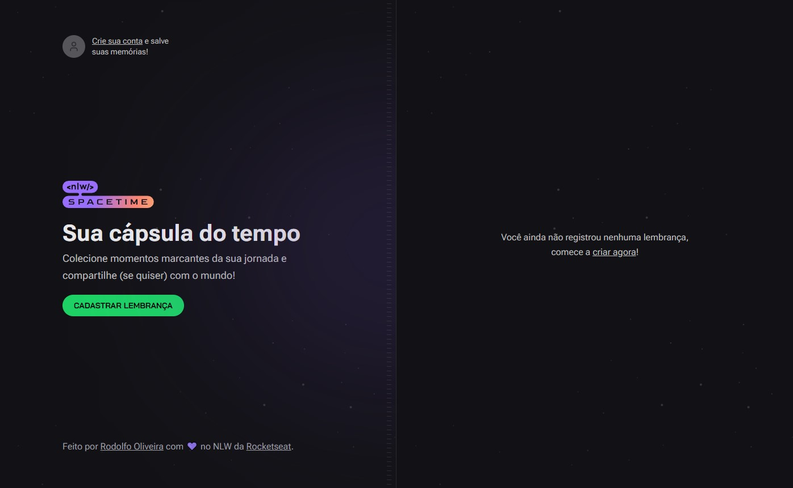
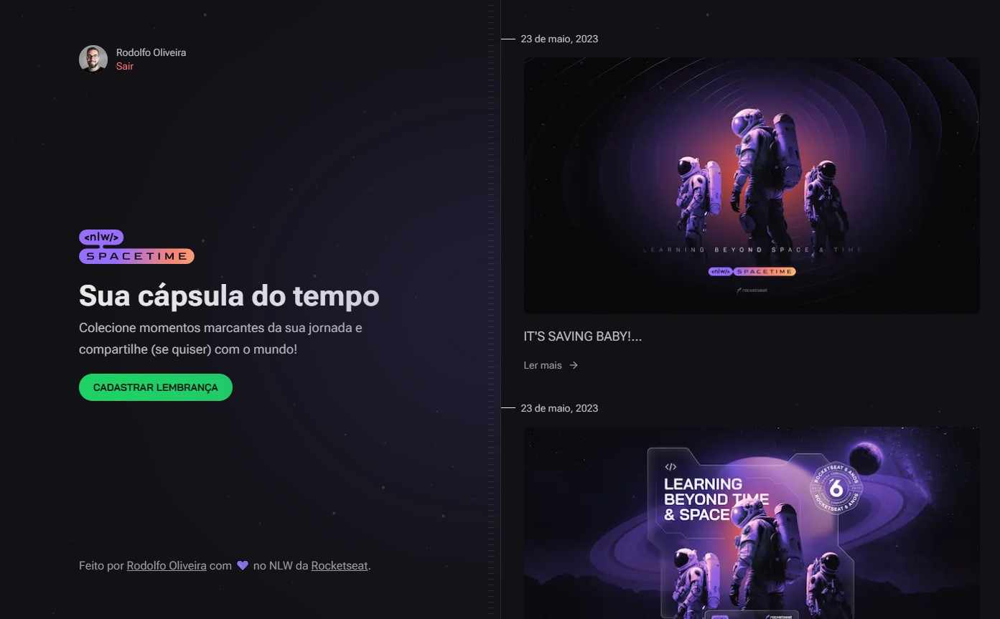
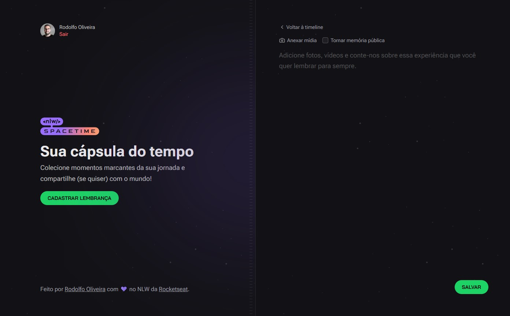

# Spacetime Machine App 👨‍🚀

Uma aplicação web e mobile que tem como objetivo servir como uma cápsula do tempo para registrar momentos e memórias em uma linha do tempo, utilizando texto e imagens.

Desenvolvida com ReactJS, React Native, NextJS, NodeJS, Tailwind e TypeScript durante o evento NLW Spacetime (Trilha Ignite) da Rocketseat.

#### Home

#### Linha do tempo com posts

#### Registrar nova memória

## :gear: Tech

- ReactJS
- React Native
- NextJS
- NodeJS
- Tailwind
- TipeScript

## 👨‍💻 Dev

- [linkedin.com/in/rodolfooliveiram](https://www.linkedin.com/in/rodolfooliveiram/)
